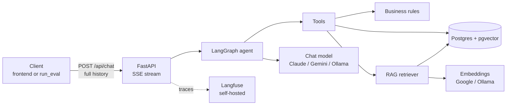
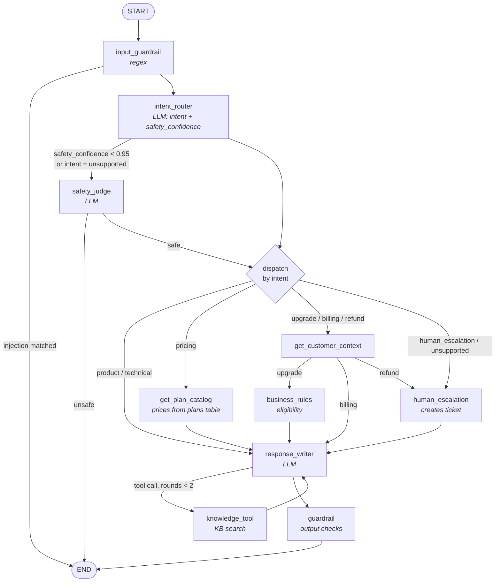

# Architecture

How a chat turn flows through the system, and where each responsibility lives. The
reasoning behind each choice is in the [architecture decision records](adr/README.md);
this page is the map.

## System

- The API is stateless: every request carries the whole conversation and runs the
  graph from an empty state ([ADR-0009](adr/0009-stateless-chat-api.md)).
- One Postgres holds plans, customers, subscriptions, tickets and the embedded
  knowledge base ([ADR-0005](adr/0005-postgres-pgvector-for-rag.md)).
- The model provider is configuration, not code
  ([ADR-0004](adr/0004-provider-agnostic-llm-and-embeddings.md)).

## The agent graph

Reading it:

- **The LLM classifies, Python routes.** Every diamond and labeled edge is a plain
  function in `app/agent/routing.py`
  ([ADR-0001](adr/0001-langgraph-with-typed-state-and-deterministic-routing.md)).
- **Input safety is a cascade**: regex, then a score that comes free with intent
  classification, then a dedicated judge when that score is low or the intent is
  `unsupported` ([ADR-0007](adr/0007-input-safety-cascade.md)).
- **Commercial facts never come from the model.** Eligibility is computed in
  `business_rules`, prices are loaded by `get_plan_catalog`, and refunds have no tool
  and always reach a human
  ([ADR-0002](adr/0002-deterministic-business-rules-layer.md)).
- **Knowledge-base search is the only action the model chooses**, on the
  KB-answerable intents (billing included), at most two rounds per turn
  ([ADR-0006](adr/0006-llm-driven-knowledge-base-search.md)).
- **Every answer passes `guardrail`**, which replaces claims that state proves false
  ([ADR-0008](adr/0008-deterministic-output-guardrails.md)).

## Code layout

| Package | Responsibility | Depends on |
|---|---|---|
| `app/api` | HTTP and SSE: request validation, streaming, tracing span | `agent`, `core`, `schemas` |
| `app/agent` | Graph, state, nodes, prompts, routing, LLM tool bindings | `tools`, `guardrails`, `core`, `schemas` |
| `app/guardrails` | Input pattern checks, output claim checks | `schemas` |
| `app/tools` | Typed, framework-agnostic operations the agent calls | `business`, `rag`, `db`, `schemas` |
| `app/business` | Pure eligibility, pricing and upsell rules | `db` (models only), `schemas` |
| `app/rag` | Load, chunk, embed, ingest; similarity search | `core`, `db`, `schemas` |
| `app/db` | SQLAlchemy models, session, seed | `core` |
| `app/core` | Settings, model and embedding factories, tracing setup | nothing in `app` |
| `app/schemas` | Pydantic contracts shared across layers | nothing in `app` |
| `evaluation/` | Dataset, evaluators, LLM judge, runner over HTTP | `app.schemas`, `app.core`, `app.db` |

Dependencies only point down this table, towards `schemas`
([ADR-0003](adr/0003-layering-and-dependency-direction.md)).

## One turn, end to end

1. The client posts `customer_id` and the full message history.
2. The graph runs; `response_writer`'s tokens stream to the client as `delta` events.
3. If `guardrail` rewrote the answer, a `correction` event carries the final text
   ([ADR-0010](adr/0010-stream-then-correct.md)).
4. A `done` event closes the turn with a typed summary (intent, escalation, ticket,
   flags, eligibility), read from graph state rather than from the text.
5. With tracing on, the whole turn is one Langfuse span, with every node, model call
   and tool call nested under it
   ([ADR-0011](adr/0011-self-hosted-langfuse-for-tracing.md)).

The evaluation suite is just another client of this flow
([ADR-0012](adr/0012-evaluation-against-the-real-api.md)).
